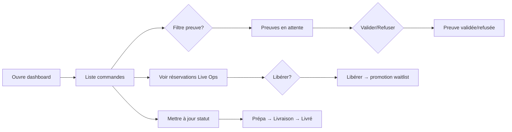

# UX Design Specification SnapSell

**Author:** Fabrice
**Date:** 2026-02-03

---

## Executive Summary

### Project Vision

SnapSell est une solution **WhatsApp-first** qui transforme n'importe quel live (TikTok, Instagram, Snap, etc.) en **commandes structurées** : le live reste sur la plateforme choisie, le checkout est unique sur WhatsApp. Le web est la **console business & ops** (abonnement, configuration, commandes, preuves d'acompte). Vision UX : un vendeur vit son premier live « propre » — liste de commandes prête à livrer, sans disputes « premier arrivé » ni réservations fantômes ; la cliente obtient l'article sans bataille et suit sa commande sans relancer.

### Target Users

- **Vendeur solo Live-first** — Vend en live seul, beaucoup de pièces uniques, chaos DM/WhatsApp. Utilise SnapSell : étiquettes codes, annonce en live, dashboard après pour commandes et preuves. Tech : smartphone + web.
- **Vendeur Stock préparé / Boutique** — Stock en quantité, live + catalogue. Utilise SnapSell : enregistrement codes/quantités (web ou WhatsApp), décrément auto, dashboard prépa/livraison.
- **Manager / Owner** — Visibilité et contrôle (vendu, confirmé, livré, no-show). Utilise surtout le web : abonnement, paramètres (catégories, TTL, acompte), dashboard, exports.
- **Agent / Assistante** — Exceptions, preuves d'acompte, statuts. Utilise le dashboard : commandes, Proofs inbox, mise à jour statuts.
- **Cliente finale** — Réserver sans stress, prix clair, confirmation rapide, suivi livraison. **WhatsApp uniquement** (pas de compte web). Réponse immédiate (« tu es #1 / #N », timer), STOP respecté.
- **Ops SnapSell** — Support, incidents, délivrabilité WhatsApp. Console ops, logs, file d'erreurs.

### Key Design Challenges

- **Double canal (WhatsApp + Web)** : parcours vendeur et cliente scindés — WhatsApp pour le checkout et le suivi client ; web pour config, commandes, preuves. L’UX doit rendre évident « où faire quoi » et garder une cohérence de langage et de statuts entre les deux.
- **Live = pression temps réel** : réponses bot P95 &lt; 2 s, messages courts et sans ambiguïté (réservé / file / expiré), timer et rappels clairs. Côté vendeur : dashboard lisible pendant ou juste après le live (commandes, réservations, libérations) sans surcharge cognitive.
- **Anti-chaos et anti-fantômes** : file d’attente, TTL, acompte recommandé + preuve (image/texte) + validation. L’UX doit expliquer simplement les règles (pourquoi un acompte, combien de temps pour confirmer) et rendre la validation des preuves rapide côté vendeur/agent.
- **Multi-rôles sur le web** : vendeur, manager, agent avec permissions différentes. Dashboard et navigation doivent refléter le rôle sans dupliquer les écrans ; délégation (invitation agent) claire et sûre.

### Design Opportunities

- **Clarté du statut partout** : même vocabulaire et mêmes états (réservé, en file, expiré, confirmé, livré) sur WhatsApp (messages bot) et sur le web (liste commandes, Live Ops). Confiance et réduction des litiges.
- **Proofs inbox centrée flux** : validation/refus des preuves d’acompte dans le flux de prépa (une commande = une ligne avec preuve à valider), pas un silo séparé. Gain de temps pour vendeur/agent.
- **Live Ops minimal mais lisible** : vue « session en cours » : codes/items, réservations en cours, actions (libérer, réouvrir). Permet au vendeur de garder le contrôle sans quitter le contexte « ce live ».
- **Onboarding vendeur court** : grille catégories→prix + connexion WhatsApp comme cœur ; valeur visible dès le premier live (liste propre). Réduction de l’abandon et adoption plus rapide.

---

## Core User Experience

### Defining Experience

**Boucles centrales (formulation nette, copiable PRD) :**

- **Cliente (boucle centrale)** : CODE → statut immédiat (réservé / file / épuisé) + timer → adresse → OUI → (acompte recommandé + preuve si activé) → suivi.
- **Vendeur (boucle centrale)** : avant live = tags collés + grille prix ; pendant = annonce codes ; après = web console (commandes + proofs inbox + live ops).

**Prix — quand il est connu :**  
Le prix n'est jamais « deviné » depuis le live vidéo : il vient soit de la grille catégorie→prix (lettre du code), soit d'un item préparé (même logique + champs enrichis). Exemple : A12 ⇒ lettre A ⇒ prix = valeur de A dans le tenant.

**OUI ambigu (plusieurs réservations actives) :**  
Si plusieurs réservations actives : OUI ⇒ bot demande « Quel code confirmes-tu ? (A12 / A13) ».

**Routage vendeur vs client (CODE = client vs vendeur) :**  
Si le numéro est **vendeur** : un message « A12 » seul **ne doit pas** déclencher une réservation cliente. Le bot répond par ex. : « Tu veux **créer** l'article A12 ? Envoie `A12 PRIX` ou `A12 QTE`. » (ou ignore selon règle produit). **Cliente** : A12 → réservation. Cela évite les erreurs en live quand le vendeur teste un code.

**Valeur perçue** : « Je n'ai plus à me battre en DM » (cliente) ; « À la fin du live j'ai une liste prête à livrer » (vendeur).

### Platform Strategy

- **WhatsApp (Twilio)** : canal unique checkout + suivi client. Messages courts, statuts explicites (réservé / file #N / épuisé), timer, rappel T-2 min. Pas de web pour la cliente.
- **Web** : console business & ops. Cible : desktop et tablette (vendeur, manager, agent) ; usage possible smartphone pour consulter dashboard. Pas d'offline MVP ; polling (ex. 30–60 s) pour liste commandes / Live Ops.
- **Live session auto** : créée à la première action live (création item vendeur ou 1er code client), clôturée après inactivité. **LIVE ON/OFF : non requis** en UX (optionnel côté tech si besoin) — l'expérience ne suppose pas de bouton.
- **Contraintes** : réponses bot P95 < 2 s ; webhook Twilio ne doit pas bloquer > 1 s ; traitement lourd asynchrone après 200.

### Effortless Interactions

- **Cliente** : taper le code et envoyer — une seule action ; le bot répond tout de suite. Pas de formulaire, pas de compte. Adresse en message libre (commune/quartier/repère). OUI pour confirmer (ou choix du code si plusieurs réservations). Preuve acompte = photo/capture si activé.
- **Vendeur** : coller l'étiquette, annoncer le code — pas de saisie prix en live. Dashboard : une liste « à préparer / à livrer » avec preuves à valider au même endroit ; libérer une réservation en un clic.
- **Automatismes** : TTL + expiration + promotion auto de la file ; rappel T-2 min ; notifications statut (confirmé, livré) sans action client.

### Réservation vs confirmation (stock et décrément)

WhatsApp et web distinguent clairement :

- **Réservé** = slot temporaire (TTL) ; pas de décrément stock.
- **Confirmé** = commande validée ; décrément stock si item en stock préparé.
- **Si TTL expire** : pas de décrément, promotion waitlist ; le bot et le dashboard reflètent ces états sans ambiguïté.

### Acompte recommandé (anti-fantômes)

Acompte **recommandé** pour sécuriser la réservation, optionnel au MVP (ou « recommandé par défaut, désactivable par le vendeur »).

- **Quand** : Acompte demandé **après OUI** (quand on a l'adresse).
- **Montant** : Fixe ou par catégorie (ex. A = 1 000 F, B = 2 000 F) ou % ; config vendeur.
- **Effet** : Tant que preuve non reçue, commande = « Confirmée / En attente acompte » et **peut expirer** — prévoir un **TTL paiement** (même court) pour éviter les commandes bloquées. Si acompte activé : message « envoie la preuve dans X min ».

### Critical Success Moments

- **Cliente** : « Tu es #1 » ou « Tu es en file #N » + timer clair → confiance que le système a bien enregistré. **Message de réservation doit rappeler prix + catégorie** : ex. « ✅ A12 réservé (Cat. A = 5 000 FCFA). Expire dans 10 min. » — évite « je croyais que A c'était 10k ». Récap prix + total + « Réponds OUI pour confirmer » → clarté avant engagement. Après confirmation : notifications utiles, pas de relance.
- **File / promotion** : File : « Tu es #3. On te prévient si ça se libère. » Promotion : « Bonne nouvelle ✅ A12 est dispo pour toi. Tu as 10 min pour confirmer : envoie ton adresse. »
- **Vendeur** : premier live terminé avec une **liste de commandes prête à livrer** + preuves d'acompte à valider au même endroit → « ça règle mon problème ». Réservation expirée → promotion auto du suivant visible dans le dashboard → pas de double vente, pas de litige manuel.
- **Échec à éviter** : réponse bot lente ou ambiguë (réservé vs file) ; dashboard illisible ou preuves noyées ailleurs ; double attribution ou statut incohérent entre WhatsApp et web.

### Experience Principles

- **Un canal, une intention** : WhatsApp = checkout + suivi client ; Web = config + commandes + preuves + Live Ops. Ne pas mélanger les rôles des canaux.
- **Réponse immédiate, message clair** : tout message client (code, adresse, OUI) déclenche une réponse rapide et sans ambiguïté (statut + prochaine étape).
- **Même vérité partout** : mêmes statuts et même vocabulaire sur WhatsApp et web ; une commande = un numéro VF-XXXX, un statut, une preuve éventuelle. Réservé ≠ confirmé ; décrément stock uniquement à la confirmation.
- **Live session auto** : créée à la première action live, clôturée après inactivité ; expérience sans LIVE ON/OFF obligatoire.
- **Moins d'étapes, plus de guidage** : pas de formulaire multi-champs pour la cliente ; pas de saisie prix en live pour le vendeur ; le bot et le dashboard guident l'action suivante.

### Message Templates v1 (WhatsApp)

*Templates de messages bot pour éviter les interprétations côté dev ; à aligner avec le routage vendeur vs client, le prix visible et les micro-copy file/promotion.*

**Liste des templates (côté cliente) :**

| Situation | Template (exemple) |
|-----------|--------------------|
| **Réservé (#1)** | ✅ A12 réservé (Cat. A = 5 000 FCFA). Expire dans 10 min. Envoie ton adresse pour confirmer. |
| **File (#N)** | Tu es #3 pour A12. On te prévient si ça se libère. |
| **Promotion** | Bonne nouvelle ✅ A12 est dispo pour toi. Tu as 10 min pour confirmer : envoie ton adresse. |
| **Expiration** | Réservation A12 expirée. Tu peux renvoyer le code si l'article repasse en live. |
| **OUI ambigu** | Quel code confirmes-tu ? (A12 / A13) |
| **Code inconnu** | Code inconnu (ex: A12). Vérifie et renvoie. |
| **Épuisé** | A12 est épuisé. Tu peux demander des articles similaires ou attendre le prochain live. |
| **Acompte demandé** | Pour confirmer, envoie la preuve d'acompte (X FCFA) dans 15 min. |
| **Preuve reçue** | Preuve reçue. Ta commande VF-1234 est confirmée. |
| **Preuve refusée** | Preuve refusée. Envoie une nouvelle preuve ou annule. |
| **Commande confirmée** | Commande VF-1234 confirmée. Tu seras notifié pour la livraison. |

**Vendeur (création item) :** Si vendeur envoie « A12 » seul → « Tu veux créer l'article A12 ? Envoie `A12 PRIX` ou `A12 QTE`. »

---

## Desired Emotional Response

### Primary Emotional Goals

- **Cliente** : se sentir **en sécurité** (réponse immédiate, statut clair, pas d'ambiguïté « premier arrivé ») ; **respectée** (STOP fonctionne, pas de spam) ; **soulagée** (pas de bataille en DM, prix et total clairs).
- **Vendeur** : se sentir **en contrôle** (le bot gère le chaos, le dashboard donne la liste prête à livrer) ; **soulagé** (fin de live = liste propre, pas de tri manuel) ; **efficace** (preuves d'acompte à valider au même endroit que les commandes).
- **Manager** : **visibilité** et **maîtrise** (règles appliquées, moins de litiges, coûts maîtrisés).

### Emotional Journey Mapping

- **Découverte** (cliente) : curiosité (« envoyez le code sur WhatsApp ») → faible friction, pas de compte.
- **Checkout** (cliente) : confiance (statut immédiat + timer) → clarté (récap prix/total) → engagement (OUI, preuve si demandée).
- **Après achat** (cliente) : tranquillité (notifications utiles, pas de relance).
- **Avant live** (vendeur) : préparation simple (tags + grille) → pas de stress « comment je vais gérer ».
- **Pendant live** (vendeur) : focus sur le live, le bot gère → réduction de l'anxiété.
- **Après live** (vendeur) : accomplissement (liste prête à livrer) ; soulagement (pas de disputes, pas de fantômes non gérés).

### Micro-Emotions

- **Confiance vs scepticisme** : réponse bot immédiate + statut sans ambiguïté (réservé / file / expiré) → confiance. Timer visible + rappel T-2 min → pas de doute « est-ce que c'est pris ? ».
- **Accomplissement vs frustration** : vendeur — « liste prête à livrer » = accomplissement ; cliente — « j'ai réservé sans me battre » = accomplissement. À éviter : message vague, statut flou, double attribution.
- **Calme vs anxiété** : vendeur — moins d'anxiété pendant le live (bot gère) ; cliente — moins d'anxiété (timer clair, pas de course au premier).
- **Respect** : cliente — STOP respecté, pas de spam ; vendeur — système qui applique les règles (TTL, acompte) sans micro-gestion.

### Design Implications

- **Confiance** → messages bot courts, statuts explicites, même vocabulaire WhatsApp + web ; pas de délai perçu (P95 &lt; 2 s).
- **Soulagement vendeur** → dashboard « à préparer / à livrer » lisible ; proofs dans le flux (pas un silo) ; libérer une réservation en un clic.
- **Respect cliente** → STOP appliqué ; rappel T-2 min sans harcèlement ; notifications utiles (confirmé, livré) sans spam.
- **Éviter frustration** → OUI ambigu géré (« Quel code confirmes-tu ? ») ; code inexistant / typo → message clair + suggestion.

### Emotional Design Principles

- **Clarté = confiance** : tout message (bot ou web) dit clairement l'état et la prochaine étape ; pas de sous-entendu.
- **Réponse immédiate = soulagement** : la cliente et le vendeur savent tout de suite où ils en sont.
- **Même vérité partout = cohérence** : mêmes statuts sur WhatsApp et web ; une commande = un numéro, un statut, une preuve éventuelle.
- **Respect explicite** : STOP, TTL, pas de spam ; le système ne surcharge pas l'utilisateur.

---

## UX Pattern Analysis & Inspiration

*Contexte cible : vendeurs live commerce en Afrique francophone ; apps qu'ils utilisent déjà (WhatsApp, Instagram/TikTok Live, Jumia/Glovo, Orange Money / Wave).*

### Inspiring Products Analysis

**1. WhatsApp Business**  
Déjà installé, interface familière, confiance établie. Ce qu'on reprend : messages rapides pré-configurés (templates type « DISPO ») ; statuts de livraison clairs (✓ envoyé / ✓✓ reçu / ✓✓ lu) → statuts réservation (⏳ en attente → ✅ confirmé → 📦 payé) ; catalogues produits (rapidité d'ajout) — à adapter pour pièces uniques / live ; étiquettes couleur pour catégoriser → dashboard vendeur (À traiter, Payé, Litige). Ce qui manque (opportunité SnapSell) : pas de réservations auto, pas de priorisation équitable, pas de preuve horodatée, pas d'analytics.

**2. Instagram Live / TikTok Live**  
Audience massive, engagement fort, viralité. Ce qu'on reprend : feedback instantané (hearts, counter viewers) → dashboard live avec métriques temps réel (participants actifs, commandes/min) ; pinned comment → overlay / message épinglé « ARTICLE EN COURS : A12 — Tapez A12 sur WhatsApp » ; badges utilisateurs (Top fan, Nouveau) → badges bot (« ⭐ Client VIP », « 🔥 Premier achat »). Ce qui manque : pas de transaction directe, commentaires chaotiques, pas de traçabilité ni gestion stock.

**3. Jumia / Glovo (e-commerce locaux)**  
Référence mentale « comment acheter en ligne ». Ce qu'on reprend : onboarding progressif (naviguer sans compte → compte au checkout) → bot WhatsApp immédiat, infos perso seulement au besoin ; Track my order (étapes claires Préparation → En route → Livré) → statuts visuels dans conversation WhatsApp (Réservée → En attente paiement → Expédiée → Livrée) ; flash sales avec countdown → TTL visible pour réservations (« ⏰ Réservation expire dans 2:34 ») ; gestion erreurs gracieuse (article rupture + alternatives) → « A12 n'est plus disponible — voici A15, A18 » ou « ALERTE pour être notifié ». Ce qui manque : pas de pièces uniques ni live intégré, friction app séparée.

**4. Orange Money / Wave (Mobile Money)**  
Méthode de paiement #1, utilisée par vendeurs et clients. Ce qu'on reprend : confirmation par SMS avec ID unique → bot envoie preuve formatée après paiement (montant, article, ID transaction, date) ; code PIN pour actions critiques → actions vendeur sensibles (annuler, rembourser) = demande mot de passe ; historique complet cherchable → dashboard filtrable (date, client, article, statut) ; notifications push pertinentes (transactions seulement) → push seulement pour nouvelle réservation, paiement reçu, litige (pas chaque message WhatsApp).

**Cas d'usage par persona**  
- **Vendeuse (ex. Aïcha, 28 ans, Abidjan)** : utilise WhatsApp Business, Instagram, Wave. Attend de SnapSell : simplicité type WhatsApp, métriques type Instagram Live, preuves type Wave.  
- **Cliente (ex. Fatoumata, 34 ans)** : utilise WhatsApp, Instagram, Orange Money. Attend : commander aussi vite qu'envoyer un message ; voir statut type Glovo ; recevoir preuve type Orange Money.

### Transferable UX Patterns

**Bot WhatsApp**

| Pattern source | App origine | Adaptation SnapSell |
|----------------|-------------|---------------------|
| Réponses rapides | WhatsApp Business | Boutons interactifs : [OUI] [NON] [VOIR SIMILAIRES] |
| Statuts visuels | Glovo | Émojis + progression : ⏳ → ✅ → 📦 → 🎉 |
| Badges utilisateurs | Instagram Live | ⭐ VIP, 🆕 Nouveau, 🔥 Top acheteur |
| Feedback instantané | TikTok | « ✅ Enregistré ! » au lieu de silence |
| Preuve transaction | Orange Money | Message récap avec ID unique |

**Dashboard vendeur**

| Pattern source | App origine | Adaptation SnapSell |
|----------------|-------------|---------------------|
| Étiquettes couleur | WhatsApp Business | Commandes par statut (rouge = urgent, vert = payé) |
| Métriques temps réel | Instagram Live | Counter participants, commandes/min, CA du jour |
| Onboarding progressif | Jumia | Peut lancer 1er live sans config complète |
| Historique cherchable | Wave | Filtres : date, client, article, montant |
| Notifications ciblées | Orange Money | Push seulement pour actions critiques |

**Proof Inbox (transparence)**

| Pattern source | App origine | Adaptation SnapSell |
|----------------|-------------|---------------------|
| Timeline claire | Glovo tracking | Horodatage précis de chaque étape |
| Preuve vérifiable | Orange Money SMS | Référence / hash de vérification si pertinent |
| Cas limites gérés | Jumia | « Article indisponible → voici alternatives » |

### Anti-Patterns to Avoid

- **Silence après action** : pas de « ✅ Enregistré ! » → anxiété (TikTok/feedback instantané à reprendre).
- **Statuts ambigus** : pas de distinction claire réservé / confirmé / payé → confusion et litiges (Glovo/statuts visuels à reprendre).
- **Dead-end sur erreur** : « Article indisponible » sans alternative ni ALERTE → frustration (Jumia/alternatives à reprendre).
- **Spam notifications** : push sur chaque message WhatsApp → méfiance (Orange Money/notifications ciblées à reprendre).
- **Friction d'adoption** : app séparée ou onboarding lourd → abandon (WhatsApp déjà installé, Jumia/onboarding progressif).
- **Pas de preuve horodatée** : litiges « qui a payé quand » → récap avec ID + date comme Orange Money.

### Design Inspiration Strategy

**What to Adopt**

- **Familiarité** : WhatsApp comme canal unique checkout (déjà installé, zéro friction).
- **Statuts visuels** : émojis + progression (⏳ → ✅ → 📦 → 🎉) dans bot et dashboard.
- **Preuve transaction** : message récap après paiement (montant, article, ID, date).
- **Étiquettes / couleurs** : dashboard par statut (À traiter, Payé, Litige) et couleurs (urgent / payé).
- **Feedback immédiat** : chaque action bot = confirmation courte (« ✅ Enregistré ! », « ⏰ Réservation expire dans 2:34 »).

**What to Adapt**

- **Catalogues WhatsApp** : rapide à l’ajout, mais SnapSell gère pièces uniques + stock préparé + même système de codes.
- **Track my order** : pas de carte livreur en MVP ; étapes claires (Réservée → Confirmée → Expédiée → Livrée) dans la conversation.
- **Badges live** : pas de gamification complexe en MVP ; option simple type « ⭐ VIP » / « 🆕 Nouveau » si pertinent.
- **Onboarding progressif** : 1er live possible sans config complète ; grille catégories + WhatsApp comme cœur.

**What to Avoid**

- App ou canal supplémentaire obligatoire (rester WhatsApp-first).
- Notifications sur chaque message (uniquement actions critiques).
- Statuts flous ou sans prochaine étape (toujours « quoi faire ensuite »).
- Erreur sans issue (toujours alternative ou message clair).

### Principes UX directeurs (3 piliers)

1. **Familiarité > Innovation** — Utiliser WhatsApp (déjà installé) ; émojis et langage naturel plutôt qu’interface complexe. Inspiration : WhatsApp Business, Orange Money.
2. **Feedback instantané et transparent** — Chaque action = confirmation visuelle immédiate ; statuts clairs, pas d’ambiguïté. Inspiration : Instagram Live, Glovo, Wave.
3. **Progressivité et tolérance à l’erreur** — Fonctionne dès le 1er message ; erreurs = suggestions alternatives, jamais de dead-end. Inspiration : Jumia, WhatsApp.

---

## Design System Foundation

*Contexte : web console (dashboard vendeur/manager/agent), MVP, besoin de rapidité et de cohérence ; familiarité > innovation (étape 5).*

### 1.1 Design System Choice

**Système thématisable (Themeable System)** — ex. **Tailwind UI / shadcn UI** ou **Chakra UI** / **MUI** selon stack technique.

- Composants éprouvés + personnalisation (couleurs, typo, espacements) pour aligner avec la marque plus tard.
- Bon compromis vitesse / unicité : patterns reconnus (listes, filtres, statuts, formulaires) sans réinventer la roue.
- Adapté à une console ops (tableaux, états, actions) et à une équipe réduite en phase MVP.

*Alternative si stack déjà fixée :* Material Design (MUI) ou Ant Design si l'équipe est déjà à l'aise ; l'essentiel est d'avoir une base cohérente (tokens, composants, accessibilité) pour le dashboard web.

### Rationale for Selection

- **Plateforme** : Web uniquement pour l'UI (dashboard) ; WhatsApp = canal natif, pas de design system côté client.
- **MVP / rapidité** : Système établi ou thématisable accélère la mise en place (listes commandes, Proofs inbox, Live Ops, filtres).
- **Familiarité** : Les utilisateurs cibles (vendeurs, managers, agents) s'attendent à une interface claire et prévisible ; pas besoin d'une identité visuelle très distinctive en Phase 1.
- **Maintenance** : Une base documentée (Tailwind/shadcn, Chakra, MUI) facilite l'évolution (nouvelles vues, rôles, thème marque) sans tout refaire.
- **Accessibilité** : Composants avec a11y intégrée (focus, contrastes, labels) pour la console ops.

### Implementation Approach

- **Tokens** : Couleurs (statuts : réservé / confirmé / payé / livré / expiré), typographie, espacements définis une fois et réutilisés (alignés avec les 3 piliers UX : clarté, feedback, progressivité).
- **Composants** : Réutilisation maximale pour listes, filtres, badges de statut, boutons d'action (valider preuve, libérer réservation, exporter CSV).
- **Patterns** : Listes + filtres (commandes), Proofs inbox dans le flux (une ligne = commande + preuve à valider), Live Ops (session en cours, actions rapides).
- **Cohérence** : Même vocabulaire et mêmes états que le bot WhatsApp (réservé, confirmé, payé, livré) pour renforcer la « même vérité partout ».

### Customization Strategy

- **Phase MVP** : Thème par défaut sobre et lisible (contraste, hiérarchie claire) ; étiquettes/couleurs par statut (ex. rouge = urgent, vert = payé) comme dans l'inspiration WhatsApp/Glovo.
- **Plus tard** : Thème marque (couleurs, typo, logo) sans changer la structure des composants ; éventuellement mode sombre si besoin.
- **Composants spécifiques** : Proofs inbox (timeline + validation), Live Ops (session en cours, libérer/réouvrir), exports CSV — peuvent être des compositions du design system plutôt que des composants one-off.

---

## 2. Defining Core Experience

*L’interaction centrale qui, si elle est réussie, fait que tout le reste suit.*

### 2.1 Defining Experience

**Phrase définitive par persona :**

- **Cliente** : « J’envoie le code sur WhatsApp → en 2 secondes je sais si c’est réservé, en file ou épuisé → je confirme → je suis livrée sans me battre en DM. »
- **Vendeur** : « À la fin du live j’ai une liste de commandes prête à livrer, avec les preuves d’acompte au même endroit — plus de disputes “premier arrivé”, plus de fantômes non gérés. »

**Une seule action critique cliente** : envoyer le code. Tout le reste est guidé par le bot (statut, timer, adresse, OUI, preuve si activé).

**Une seule action critique vendeur** : ouvrir le dashboard après le live et voir la liste prête à préparer/livrer + preuves à valider.

### 2.2 User Mental Model

- **Cliente** : « Je réserve comme j’envoie un message » — modèle WhatsApp (message → réponse). Attente : réponse rapide, statut clair, pas de formulaire ni de compte. Risque de confusion : OUI avec plusieurs réservations → le bot demande « Quel code confirmes-tu ? ». Code inexistant ou typo → message clair + suggestion.
- **Vendeur** : « Pendant le live j’annonce les codes ; après, je trie les commandes » — modèle actuel = chaos (qui a pris quoi, à quel prix). Attente SnapSell : le bot gère ; après le live = une liste claire. Risque : croire qu’il faut tout cataloguer avant → on insiste sur « codes + grille, pas de catalogue obligatoire » et live session auto.
- **Manager / Agent** : « Je vois ce qui est vendu, confirmé, livré ; je valide les preuves et je règle les litiges » — modèle dashboard ops. Attente : mêmes statuts que le bot, proofs dans le flux (pas un silo).

### 2.3 Success Criteria

- **Réponse bot** : P95 &lt; 2 s ; statut sans ambiguïté (réservé / file #N / épuisé) ; timer visible ; rappel T-2 min sans harcèlement.
- **Cliente** : « Tu es #1 » ou « Tu es en file #N » → confiance ; récap prix + total + « Réponds OUI pour confirmer » → clarté ; après confirmation → notifications utiles, pas de relance.
- **Vendeur** : liste « à préparer / à livrer » lisible ; preuves d’acompte à valider au même endroit ; libérer une réservation en un clic ; réservation expirée → promotion auto visible → pas de double vente.
- **Système** : 0 double attribution (audit) ; mêmes statuts et même vocabulaire sur WhatsApp et web ; réservé ≠ confirmé ; décrément stock uniquement à la confirmation.

### 2.4 Novel UX Patterns

- **Patterns établis combinés** : checkout 100 % WhatsApp (pas d’app à télécharger) ; réservation atomique + file + TTL (remplace le « premier arrivé » manuel) ; prix par catégorie sans saisie en live (grille tenant). Pas de pattern totalement nouveau ; les utilisateurs reconnaissent « envoyer un message » et « liste de commandes ».
- **Éducation minimale** : le vendeur annonce « envoyez le code sur WhatsApp » ; la cliente envoie le code. Le bot guide la suite (statut, timer, adresse, OUI, preuve). Aucune formation lourde.
- **Twist** : une seule action (code) pour la cliente ; une seule vue (liste prête à livrer) pour le vendeur — le reste est automatique ou guidé.

### 2.5 Experience Mechanics

**Cliente — Initiation :** entend en live « envoyez [code] sur WhatsApp » ; ouvre WhatsApp, envoie le code. **Interaction :** bot répond en &lt; 2 s (réservé / file / épuisé) + timer ; cliente envoie adresse ; bot envoie récap ; cliente répond OUI (ou choisit le code si plusieurs réservations) ; si acompte activé, envoie preuve. **Feedback :** chaque message déclenche une réponse claire (statut + prochaine étape). **Completion :** commande confirmée ; notifications (confirmé, livré) ; cliente sait qu’elle n’a plus à relancer.

**Vendeur — Initiation :** avant le live : colle les tags (A12, B07…), grille catégories→prix déjà configurée ; pendant : annonce les codes. **Interaction :** les clientes envoient les codes ; le bot gère (le vendeur ne fait rien côté SnapSell pendant le live). Après le live : ouvre le dashboard web. **Feedback :** liste commandes avec statuts ; preuves à valider dans le flux ; Live Ops (réservations en cours, libérer si besoin). **Completion :** liste « à préparer / à livrer » prête ; preuves validées ou refusées ; pas de tri manuel, pas de disputes à gérer à la main.

---

## Visual Design Foundation

*Contexte : dashboard web (console ops), Phase MVP ; pas de guidelines marque imposées — fondation alignée avec objectifs émotionnels (clarté, confiance, soulagement) et design system thématisable (étape 6).*

### Color System

- **Sémantique statuts (prioritaire)** : couleurs dédiées pour réservé / confirmé / payé / livré / expiré (alignées avec le bot WhatsApp et l’inspiration Glovo). Ex. : réservé = bleu/indigo ; confirmé = vert ; payé = vert foncé ; livré = vert succès ; expiré = gris ; urgent = orange/rouge. Badges et étiquettes de liste cohérents avec ces couleurs.
- **Primary / secondary** : palette sobre pour actions principales (boutons, liens) et secondaires (bordure, fonds discrets). Thématisable plus tard pour marque.
- **Success / warning / error** : vert (succès, validé), orange (attention, TTL proche), rouge (erreur, refusé, urgent). Contraste suffisant pour accessibilité (WCAG AA).
- **Fonds et surfaces** : fond de page neutre (gris très clair ou blanc) ; cartes/listes sur fond blanc ou surface légèrement contrastée pour hiérarchie.

### Typography System

- **Ton** : professionnel et lisible ; console ops = headings courts, listes, labels — pas de long texte. Hiérarchie claire (titre page, titre section, ligne de liste, label, caption).
- **Échelle** : type scale cohérent (ex. 1.25 ou 1.2) — h1, h2, h3, body, small/caption. Body 16px base pour lisibilité ; labels et statuts lisibles sans zoom.
- **Polices** : primary = sans-serif système ou web (ex. Inter, system-ui) pour rapidité et familiarité ; secondary optionnelle pour titres si marque le demande plus tard. Pas de police décorative en MVP.
- **Line height** : 1.4–1.5 pour le body ; titres plus serrés. Espacement entre paragraphes si contenu long (rare en dashboard).

### Spacing & Layout Foundation

- **Unité de base** : 4px ou 8px ; espacements en multiples (8, 16, 24, 32) pour cohérence. Composants du design system (listes, filtres, boutons) utilisent ces tokens.
- **Densité** : équilibre « efficace mais lisible » — listes commandes et Proofs inbox lisibles sans surcharge ; blanc suffisant entre lignes et blocs pour scanner vite.
- **Grille** : grille 12 colonnes pour layout dashboard (sidebar + contenu, ou full-width listes) ; marges et gouttières cohérentes. Responsive : desktop/tablette prioritaire ; smartphone en consultation.
- **Composants** : espacement interne cohérent (padding boutons, cartes, lignes de tableau) ; alignement vertical des labels et valeurs.

### Accessibility Considerations

- **Contraste** : texte sur fond ≥ 4.5:1 (WCAG AA) ; liens et boutons identifiables (contraste + soulignement ou style distinct). Badges de statut lisibles (texte + fond).
- **Focus** : outline visible au focus clavier pour tous les éléments interactifs (boutons, liens, filtres, actions Proofs inbox). Pas de suppression d’outline sans remplacement.
- **Labels** : champs de formulaire et filtres associés à un label visible ou aria-label ; boutons d’action avec libellé clair (Valider preuve, Libérer réservation, Exporter CSV).
- **Statuts** : ne pas reposer uniquement sur la couleur — combiner avec icône ou texte (ex. « Réservé », « Confirmé ») pour daltoniens et lecteurs d’écran.

---

## Design Direction Decision

*Directions explorées à partir de la fondation visuelle (étape 8) et du design system (étape 6) ; choix aligné avec objectifs émotionnels (clarté, confiance, soulagement) et parcours ops (listes, Proofs inbox, Live Ops).*

### Design Directions Explored

- **Direction 1 — Sobre & ops** : Dashboard dense mais lisible ; listes commandes en tableau avec badges de statut (couleurs sémantiques) ; Proofs inbox dans le flux (une ligne = commande + preuve à valider) ; navigation simple (Commandes, Live Ops, Proofs, Paramètres). Alignée avec « familiarité > innovation » et console ops.
- **Direction 2 — Dense & efficace** : Même structure, densité plus forte (plus de lignes visibles, filtres inline) ; couleurs statuts plus marquées ; actions rapides (Valider / Refuser, Libérer) en boutons courts. Pour vendeurs/agents qui enchaînent beaucoup de commandes.
- **Direction 3 — Spacieux & lisible** : Plus de blanc entre blocs ; cartes par commande plutôt que lignes serrées ; Proofs inbox en cartes avec preview preuve. Pour priorité lisibilité et réduction de charge cognitive.

### Chosen Direction

**Direction 1 — Sobre & ops** comme base, avec emprunts à la Direction 2 (actions rapides visibles, badges statuts clairs).

- **Layout** : Liste commandes en tableau ; colonnes : numéro VF-XXXX, code, statut (badge), client, preuve (à valider / validée / refusée), actions (Valider preuve, Libérer si réservation). Filtres par statut et date. Proofs inbox = même liste avec filtre « Preuve en attente » ou onglet dédié dans le flux.
- **Vue par statut (must)** : Filtres/vues « À préparer » / « À livrer » / « Litige » / « En attente preuve » pour l'exécution.
- **Recherche (must)** : Par code et par téléphone client.
- **Détail commande (must)** : Au moins 1 écran minimal : adresse + preuve + historique events ; sans ça l'agent est obligé de deviner ou d'aller dans les logs.
- **Navigation** : Sidebar ou tabs : Commandes, Live Ops (session en cours), Proofs (ou intégré Commandes), Paramètres. Rôle visible (vendeur / manager / agent).
- **Poids visuel** : Sobre ; couleurs réservées aux statuts et aux actions primaires ; fond neutre, texte lisible.

### Design Rationale

- **Alignement émotionnel** : Clarté (hiérarchie lisible, statuts sans ambiguïté), confiance (même vocabulaire que le bot), soulagement (liste prête à livrer, preuves au même endroit).
- **Alignement parcours** : Vendeur ouvre le dashboard → voit la liste ; Proofs à valider dans le flux (pas un silo). **Règle permissions** : agent peut valider, vendeur aussi, manager paramètre (config acompte, etc.). Live Ops = vue « session en cours » avec actions libérer/réouvrir.
- **MVP** : Pas de sur-design ; composants du design system (listes, filtres, badges, boutons) suffisent ; thème marque possible plus tard.

### Implementation Approach

- **Composants** : Tableaux/listes avec tri et filtres ; badges de statut (tokens couleur étape 8) ; boutons d'action (Valider preuve, Refuser, Libérer réservation, Exporter CSV).
- **Pages/vues** : Liste commandes (avec filtre preuve en attente) ; Live Ops (session active, réservations en cours) ; Paramètres (grille catégories, TTL, acompte, WhatsApp). Proofs inbox = vue filtrée ou section dédiée dans la liste commandes.
- **Cohérence** : Même sémantique statuts que le bot WhatsApp (réservé, confirmé, payé, livré, expiré) ; libellés et couleurs alignés avec la spec.

---

## User Journey Flows

*Parcours critiques issus du PRD et de la spec ; diagrammes Mermaid pour mécanique détaillée.*

### 1. Cliente — Checkout WhatsApp

**Objectif :** Réserver un article (code) → confirmer (adresse + OUI) → (preuve acompte si activée) → suivre la commande.

**Points d’entrée :** En live, entend « envoyez [code] sur WhatsApp » ; ouvre WhatsApp, envoie le code.

**Points de décision :** Code valide ? → réservé / file / épuisé. **Code inconnu** (typo) → « Code inconnu (ex: A12). Vérifie et renvoie. » **Épuisé** seulement si le code existe mais stock = 0 / vendu. Plusieurs réservations actives ? → OUI déclenche « Quel code confirmes-tu ? ». Acompte activé ? → envoi preuve dans X min (+ TTL paiement si preuve non reçue).

**Feedback :** Chaque message → réponse bot &lt; 2 s (statut + prochaine étape). Timer visible ; rappel T-2 min.

**Succès :** Commande confirmée ; notifications (confirmé, livré) ; pas de relance.

```mermaid
flowchart LR
  A[Envoie code] --> B{Code valide?}
  B -->|Oui dispo| C[Réservé + timer]
  B -->|Déjà réservé| D[File #N + timer]
  B -->|Code inconnu (typo)| E1[Code inconnu. Vérifie et renvoie.]
  B -->|Code existe, stock=0| E2[Épuisé]
  C --> F[Envoie adresse]
  D --> F
  F --> G[Bot: récap prix + total]
  G --> H{OUI?}
  H -->|Plusieurs réservations| I[Quel code confirmes-tu?]
  I --> H
  H -->|Oui| J{Acompte activé?}
  J -->|Oui| K[Envoie preuve dans X min]
  J -->|Non| L[Confirmé]
  K --> L
  L --> M[Notifications statut]
```

### 2. Vendeur — Après live (dashboard)

**Objectif :** Ouvrir le dashboard → voir la liste des commandes prête à préparer/livrer → valider les preuves d’acompte → mettre à jour les statuts (prépa → livraison → livré).

**Points d’entrée :** Fin de live ; ouvre le web, accède à Commandes (ou Proofs si filtre dédié).

**Points de décision :** Preuve en attente ? → Valider / Refuser. Réservation à libérer ? → Libérer (promotion waitlist). Filtres : statut, date, preuve en attente.

**Feedback :** Liste à jour (polling 30–60 s) ; badges statut clairs ; actions immédiates (Valider, Refuser, Libérer).

**Succès :** Liste « à préparer / à livrer » lisible ; preuves traitées ; pas de tri manuel ni de litiges à gérer à la main.



### 3. Vendeur — Avant et pendant live

**Objectif :** Avant : tags collés + grille catégories→prix configurée. Pendant : annoncer les codes ; le bot gère. Aucune action SnapSell pendant le live (sauf consultation Live Ops si besoin).

**Points d’entrée :** Config déjà faite (étape onboarding). Live session auto à la première action (création item ou 1er code client).

**Succès :** Pas de saisie prix en live ; pas de bouton LIVE ON/OFF obligatoire ; à la fin du live, liste prête dans le dashboard.

### Journey Patterns

- **Une action, une réponse** : Chaque message client (code, adresse, OUI) → réponse bot immédiate (statut + prochaine étape). Pas de silence.
- **Statuts explicites** : Réservé / file / épuisé / confirmé / livré — même vocabulaire sur WhatsApp et web.
- **Proofs dans le flux** : Une ligne = commande + preuve à valider (pas un silo) ; actions Valider / Refuser / Libérer visibles.
- **Navigation prévisible** : Commandes, Live Ops, Proofs (ou filtre), Paramètres ; rôle visible (vendeur / manager / agent).

### Flow Optimization Principles

- **Réduire les étapes jusqu’à la valeur** : Cliente — une action (envoyer le code) ; vendeur — une vue (liste prête à livrer).
- **Alléger la charge cognitive** : Un seul choix à la fois (statut, puis adresse, puis OUI) ; OUI ambigu géré par « Quel code confirmes-tu ? ».
- **Feedback et progression** : Timer visible ; rappel T-2 min ; badges statut ; liste à jour (polling).
- **Gestion d’erreurs** : **Code inconnu** (typo) → « Code inconnu (ex: A12). Vérifie et renvoie. » ; **Épuisé** (code existe, stock = 0) → alternatives ou ALERTE ; pas de dead-end.

---

## Component Strategy

*Stratégie de composants basée sur le design system (étape 6), la direction de design (étape 9) et les parcours (étape 10).*

### Design System Components

**Disponibles depuis le design system (Tailwind UI / shadcn UI ou Chakra / MUI) :**

- **Listes / tableaux** : Table, DataTable avec tri et pagination ; lignes cliquables ou sélectionnables.
- **Filtres** : Select, Dropdown, Checkbox group pour statut, date, « Preuve en attente ».
- **Badges** : Badge avec variantes couleur (statuts : réservé, confirmé, payé, livré, expiré, urgent).
- **Boutons** : Button primary/secondary/danger ; actions Valider, Refuser, Libérer, Exporter CSV.
- **Formulaires** : Input, Label, validation ; pour Paramètres (grille catégories, TTL, acompte).
- **Navigation** : Sidebar ou Tabs (Commandes, Live Ops, Proofs, Paramètres).
- **Feedback** : Toast ou Snackbar pour confirmation d’action ; Spinner pour chargement.

**Couverture** : Listes commandes, filtres, badges de statut, boutons d’action, navigation et paramètres sont couverts par le design system. Les écarts concernent les compositions spécifiques (ligne commande + preuve, vue Live Ops).

### Custom Components

**1. OrderRowWithProof (ligne commande + preuve)**

- **Objectif** : Une ligne = commande (VF-XXXX, code, statut, client) + preuve à valider (preview image/texte, boutons Valider / Refuser) ; Proofs inbox dans le flux.
- **Contenu** : Numéro commande, code, badge statut, client, colonne « Preuve » (à valider / validée / refusée), actions (Valider preuve, Refuser, Libérer si réservation).
- **États** : Default ; preuve en attente (highlight léger) ; preuve validée/refusée ; réservation (bouton Libérer visible).
- **Accessibilité** : Labels sur chaque action ; focus clavier ; aria-label sur boutons (Valider preuve pour VF-1234).
- **Composition** : Table row + Badge(s) + Button group du design system.

**2. LiveOpsSessionView (vue session en cours)**

- **Objectif** : Afficher la session live active : **liste codes + état + timer + action libérer** (priorité MVP). Métriques (commandes/min, etc.) optionnelles plus tard.
- **Contenu** : Liste des items de la session (code, statut, réservation associée) ; réservations avec timer ; boutons Libérer, Réouvrir.
- **États** : Session active (données à jour, polling) ; session fermée (message « Aucune session active »).
- **Accessibilité** : Titre de section ; labels sur actions ; statuts avec icône + texte.
- **Composition** : Card(s) ou List + Badge + Button du design system.

**3. StatusBadge (badge statut commande)**

- **Objectif** : Afficher le statut (réservé, confirmé, payé, livré, expiré, urgent) avec couleur sémantique + texte ; pas uniquement la couleur (a11y).
- **Variantes** : Une variante par statut ; couleurs alignées avec les tokens (étape 8).
- **Accessibilité** : Texte lisible (ex. « Réservé », « Confirmé ») ; contraste WCAG AA.

**4. ProofsInboxFilter (filtre preuves en attente)**

- **Objectif** : Filtrer la liste commandes sur « Preuve en attente » (ou onglet Proofs) pour accéder rapidement aux preuves à valider.
- **Comportement** : Filtre ou onglet qui affiche uniquement les lignes avec preuve à valider ; même composant OrderRowWithProof.

### Component Implementation Strategy

- **Foundation** : Réutiliser au maximum les composants du design system (Table, Badge, Button, Select, Tabs).
- **Custom** : Construire OrderRowWithProof, LiveOpsSessionView, StatusBadge, ProofsInboxFilter comme compositions (tokens couleur, typo, espacements du design system).
- **Cohérence** : Même sémantique statuts que le bot WhatsApp (réservé, confirmé, payé, livré, expiré) ; libellés et couleurs alignés avec la spec.
- **Accessibilité** : Labels visibles ou aria-label ; focus clavier ; statuts avec icône + texte ; contraste suffisant.

### Implementation Roadmap

**Phase 1 — Composants critiques (parcours vendeur après live)**

- Liste commandes (Table + StatusBadge + colonnes VF-XXXX, code, statut, client).
- OrderRowWithProof (ligne + preuve + Valider / Refuser / Libérer).
- Filtres (statut, date, Preuve en attente).
- Navigation (Commandes, Live Ops, Paramètres).

**Phase 2 — Composants support**

- LiveOpsSessionView (session en cours, réservations, Libérer / Réouvrir).
- ProofsInboxFilter (filtre ou onglet Proofs).
- Paramètres (grille catégories, TTL, acompte, WhatsApp) — formulaires design system.

**Phase 3 — Renforts**

- Exports CSV (bouton + modal ou téléchargement direct).
- Toasts / feedback après actions (Valider preuve, Libérer).
- Rôle visible (vendeur / manager / agent) et permissions si besoin.

---

## UX Consistency Patterns

*Patterns de cohérence pour situations courantes : boutons, feedback, formulaires, navigation, états vides/chargement, filtres.*

### Button Hierarchy

- **Primary** : Action principale de la vue (ex. Valider preuve, Libérer réservation, Exporter CSV). Un seul primary par bloc ou ligne si plusieurs actions possibles.
- **Secondary** : Actions secondaires (ex. Refuser preuve, Annuler, Filtres). Style discret (outline ou texte).
- **Danger** : Actions destructives ou refus (ex. Refuser preuve). Couleur erreur/attention ; confirmation si impact fort.
- **Règle** : Dans une ligne commande (OrderRowWithProof), Valider = primary, Refuser = danger ou secondary selon gravité ; Libérer = secondary ou primary selon contexte.
- **Accessibilité** : Libellé clair (Valider preuve pour VF-1234) ; focus visible ; pas de bouton sans label.

### Feedback Patterns

- **Succès** : Toast ou message court après action (Preuve validée, Réservation libérée, Export lancé). Disparition automatique (ex. 3 s) ; pas de spam.
- **Erreur** : Message explicite (ex. Erreur lors de la validation, réessayez) ; reste visible jusqu’à action utilisateur ou nouvelle tentative.
- **Warning** : Pour attention sans blocage (ex. TTL proche, stock faible). Couleur warning ; pas de modal bloquant sauf si critique.
- **Info** : Statuts dans la liste (badges) ; pas de toast pour chaque mise à jour de statut (polling) — uniquement pour actions explicites de l’utilisateur.
- **Règle** : Une action utilisateur = un feedback (succès ou erreur) ; pas de notification pour chaque message WhatsApp côté vendeur.

### Form Patterns

- **Paramètres** : Grille catégories→prix, TTL, acompte, WhatsApp. Champs avec label visible ; validation inline (erreur sous le champ) ; bouton Enregistrer primary.
- **Validation** : Message d’erreur clair (ex. Montant invalide, valeur entre X et Y) ; pas de soumission si invalide.
- **Sauvegarde** : Feedback après Enregistrer (Toast « Paramètres enregistrés » ou équivalent).
- **Accessibilité** : Label associé à chaque champ (for/id ou aria-label) ; erreurs annoncées (aria-live si besoin).

### Navigation Patterns

- **Structure** : Commandes (liste par défaut), Live Ops (session en cours), Proofs (ou filtre Preuve en attente dans Commandes), Paramètres. Rôle visible (vendeur / manager / agent) si permissions différentes.
- **Sidebar ou Tabs** : Une seule navigation principale ; item actif clairement indiqué.
- **Breadcrumb** : Optionnel en MVP (liste plate) ; utile si sous-vues (ex. Détail commande) plus tard.
- **Mobile** : Navigation repliable (hamburger ou bottom nav) ; même structure, densité adaptée.

### Additional Patterns

- **Empty states** : Liste commandes vide → message « Aucune commande pour le moment » + court rappel (ex. Les commandes apparaissent après vos lives). Pas de bloc vide sans explication.
- **Loading** : Liste en chargement → Skeleton ou Spinner ; pas de flash (éviter liste vide puis remplie sans indicateur).
- **Filtres** : Filtres par statut et date toujours accessibles (inline ou drawer) ; filtre « Preuve en attente » visible pour accès rapide aux proofs.
- **Statuts** : Badge avec couleur sémantique + texte (Réservé, Confirmé, Payé, Livré, Expiré, Urgent) ; jamais couleur seule (a11y). Même vocabulaire que le bot WhatsApp.

---

## Responsive Design & Accessibility

*Stratégie responsive et accessibilité pour le dashboard web (console ops) ; alignée avec la fondation visuelle (étape 8) et les patterns UX (étape 12).*

### Responsive Strategy

- **Desktop (prioritaire)** : Cible principale vendeur/manager/agent. Utilisation de l’espace : sidebar ou tabs, liste commandes en tableau, colonnes visibles (VF-XXXX, code, statut, client, preuve, actions). Densité lisible sans surcharge.
- **Tablet** : Même structure ; navigation repliable si besoin ; tableau scroll horizontal ou colonnes prioritaires visibles. Zones tactiles suffisantes (boutons Valider/Refuser/Libérer).
- **Mobile** : Consultation du dashboard possible (liste commandes, Proofs, Live Ops) ; navigation hamburger ou bottom nav. Priorité : liste lisible, actions accessibles ; filtres en drawer ou collapse. Pas d’édition lourde requise en MVP sur mobile — usage principal = consultation et validation preuves.

### Breakpoint Strategy

- **Mobile** : 320px – 767px. Navigation repliable ; liste en cartes ou tableau scroll ; actions par ligne ou menu contextuel.
- **Tablet** : 768px – 1023px. Sidebar ou tabs ; tableau adapté ; touch targets ≥ 44px.
- **Desktop** : 1024px+. Layout complet ; sidebar/tabs fixes ; tableau avec colonnes visibles.

Approche **desktop-first** pour le MVP (console ops) ; adaptations mobile/tablet pour consultation et actions critiques (Valider preuve, Libérer).

### Accessibility Strategy

- **Niveau cible** : **WCAG 2.1 Level AA** (recommandé pour bonnes pratiques et conformité).
- **Contraste** : Texte sur fond ≥ 4.5:1 (texte normal) ; liens et boutons identifiables (contraste + style distinct). Badges de statut lisibles (texte + fond).
- **Clavier** : Toutes les actions (Valider, Refuser, Libérer, filtres, navigation) accessibles au clavier ; ordre de tabulation logique ; focus visible (outline ou équivalent).
- **Lecteur d’écran** : Structure sémantique (titres, listes, boutons) ; labels sur champs et boutons (visible ou aria-label) ; statuts annoncés (texte + rôle ARIA si besoin).
- **Touch targets** : Minimum 44×44px pour boutons et liens sur mobile/tablet.
- **Statuts** : Ne pas reposer uniquement sur la couleur — icône ou texte (ex. « Réservé », « Confirmé ») pour daltoniens et lecteurs d’écran.

### Testing Strategy

- **Responsive** : Test sur viewports réels (mobile 375px, tablet 768px, desktop 1280px) ; Chrome, Firefox, Safari, Edge. Vérifier liste commandes, Proofs inbox, Live Ops, Paramètres.
- **Accessibilité** : Outils automatisés (Lighthouse, axe) ; navigation clavier seule ; test lecteur d’écran (VoiceOver, NVDA) sur parcours critiques (liste → Valider preuve, Libérer). Simulation daltonisme pour badges statuts.
- **Utilisateurs** : Inclure si possible des tests avec utilisateurs recourant à des technologies d’assistances ; valider sur appareils cibles (Afrique francophone : Android/iOS, connexions variables).

### Implementation Guidelines

- **Responsive** : Unités relatives (rem, %, min/max-width) ; media queries à partir des breakpoints (768px, 1024px) ; images/assets adaptés si besoin.
- **Accessibilité** : HTML sémantique (header, main, nav, table, button) ; aria-label sur boutons d’icône et actions contextuelles ; gestion du focus (modals, toasts) ; skip link vers contenu principal si utile.
- **Focus** : Ne pas supprimer l’outline sans remplacement visible ; focus trap dans modals si présents.
- **Contraste** : Tokens couleur (étape 8) vérifiés pour ratio 4.5:1 sur fonds utilisés.

---

<!-- UX design content will be appended sequentially through collaborative workflow steps -->
